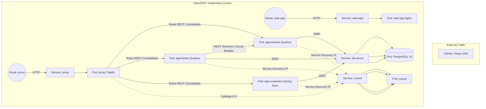
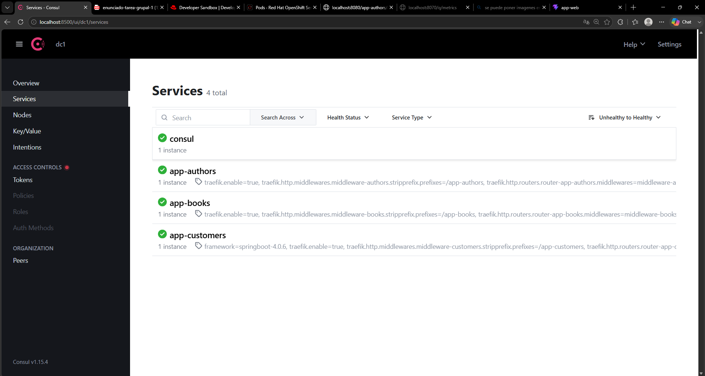
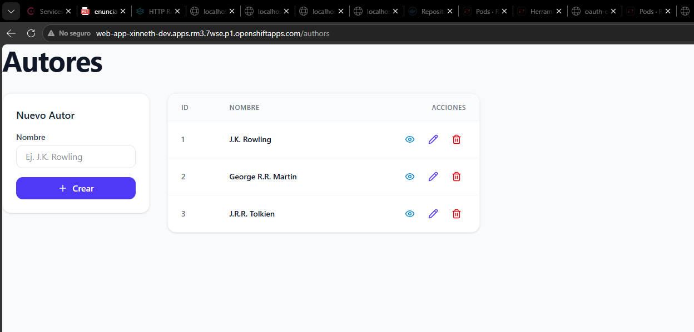
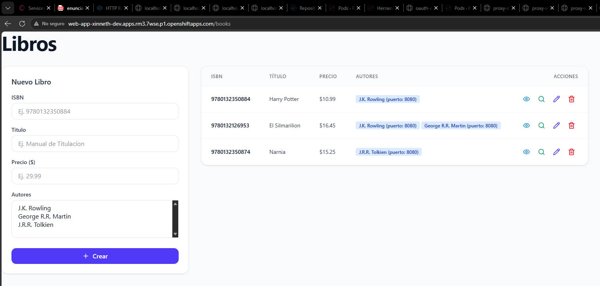
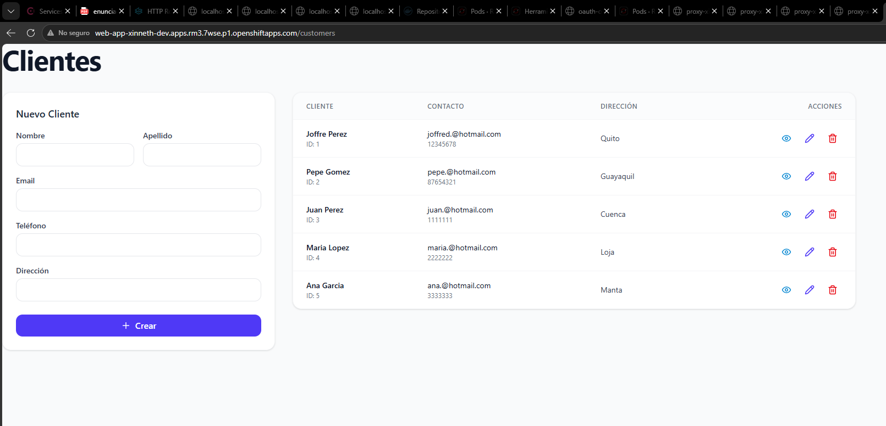
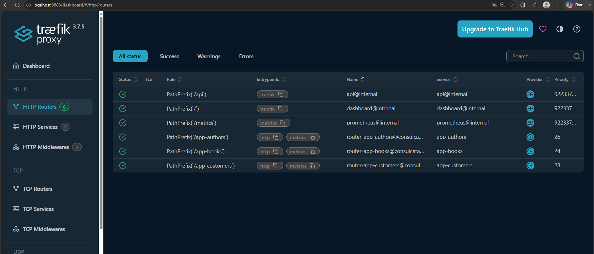
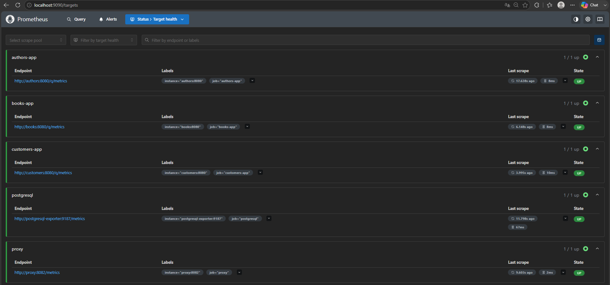
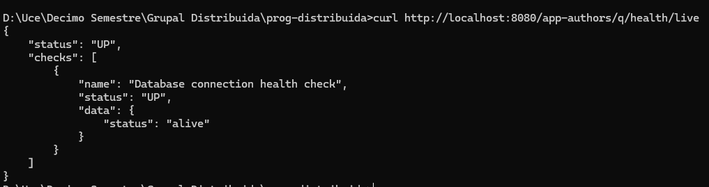
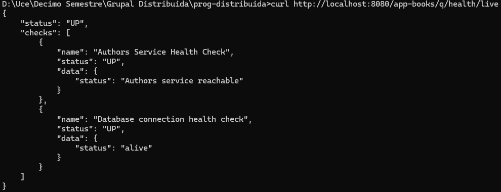
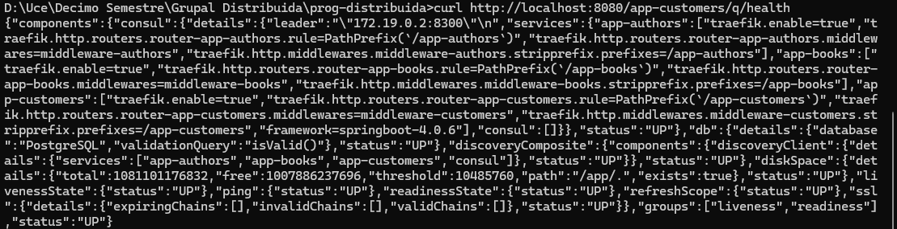

# Trabajo Grupal 1: Microservicios con Quarkus, Spring Boot, React y OpenShift

Este documento describe la arquitectura, decisiones de diseño y el cumplimiento técnico de los requisitos planteados en la rúbrica del proyecto de Microservicios Distribuidos.

## 1. Integrantes
- **Arias Basantes Joffre David** - CI: 1753106762
- **Hurtado Tinoco Kevin David** - CI: 1724693112
- **Simbana Pulupa Pablo Fernando** - CI: 1752245041

---

## 2. Arquitectura

El sistema se compone de una arquitectura distribuida orientada a microservicios, gestionada mediante Service Discovery y orquestada completamente en plataformas Kubernetes/OpenShift.



---

## 3. Tabla de Endpoints API

| Microservicio | Método | Ruta Expuesta (Traefik) | Endpoint Interno | Respuesta |
|--------------|--------|----------------------|------------------|-----------|
| **Authors** | GET | `/app-authors/authors` | `/authors` | 200 OK (List<Author>) |
| **Authors** | GET | `/app-authors/authors/{id}` | `/authors/{id}` | 200 OK / 404 Not Found |
| **Authors** | POST | `/app-authors/authors` | `/authors` | 201 Created |
| **Books** | GET | `/app-books/books` | `/books` | 200 OK (List<BookDto>) |
| **Books** | GET | `/app-books/books/{isbn}` | `/books/{isbn}` | 200 OK / 404 Not Found |
| **Books** | POST | `/app-books/books` | `/books` | 201 Created |
| **Customers**| GET | `/app-customers/customers`| `/customers` | 200 OK (List<Customer>)|
| **Customers**| POST | `/app-customers/customers`| `/customers` | 201 Created / 400 Bad Req |

---

## 4. Health Checks

Las rutas internas fueron estandarizadas arquitectónicamente para unificar el monitoreo del clúster.

| Microservicio | URL de Health (Localhost o Ruta OpenShift) | Framework Usado |
|--------------|--------------------------------------------|-------------------------|
| **app-authors** | `http://[HOST]/app-authors/q/health/live` | MicroProfile Health (Quarkus) |
| **app-books** | `http://[HOST]/app-books/q/health/live` | MicroProfile Health (Quarkus) |
| **app-customers**| `http://[HOST]/app-customers/q/health` | Spring Boot Actuator |

*(Nota: Actuator fue configurado para coincidir con la nomenclatura `/q/*` de Quarkus, permitiendo reglas de scraping unificadas).*

---

## 5. Instrucciones de Ejecución

### Entorno Local (Docker Compose)
1. Abrir terminal en la carpeta raíz del proyecto (`deployment-grupal`).
2. Levantar la infraestructura:
   ```bash
   docker-compose build
   docker-compose up -d
   ```
3. El frontend estará en `http://localhost:5173`.

### Minikube
1. Iniciar el clúster:
   ```bash
   minikube start
   ```
2. Desplegar los recursos:
   ```bash
   kubectl apply -f deployment-grupal/k8s/
   ```
3. Exponer y acceder a los servicios:
   ```bash
   minikube service proxy
   minikube service web-app
   ```

### OpenShift
1. Iniciar sesión vía CLI (`oc login`).
2. Desplegar ConfigMaps, Secrets, Deployments y Services:
   ```bash
   oc apply -f deployment-grupal/k8s/
   ```
3. Exponer los servicios públicamente creando las Routes:
   ```bash
   oc expose svc/proxy
   oc expose svc/web-app
   oc get routes
   ```

---

## 6. Verificación (Ejemplos de cURL)

*(Sustituir `[HOST]` por `localhost:8080` en local, o por la Route del proxy en OpenShift).*

**Authors:**
```bash
curl -X GET http://[HOST]/app-authors/authors
curl -X POST http://[HOST]/app-authors/authors -H "Content-Type: application/json" -d '{"name": "Robert C. Martin"}'
```

**Books:**
```bash
curl -X GET http://[HOST]/app-books/books
curl -X POST http://[HOST]/app-books/books -H "Content-Type: application/json" -d '{"isbn": "12345", "title": "Clean Code", "price": 45.99}'
```

**Customers:**
```bash
curl -X GET http://[HOST]/app-customers/customers
curl -X POST http://[HOST]/app-customers/customers -H "Content-Type: application/json" -d '{"firstName": "John", "lastName": "Doe", "email": "john@mail.com"}'
```

---

## 7. Circuit Breaker (@Fallback)

En `app-books`, el método que consulta al microservicio de autores mediante la interfaz REST Client está protegido con las anotaciones `@CircuitBreaker`, `@Retry`, y `@Fallback`.

**Cómo probarlo:**
1. Detener intencionalmente el microservicio de autores (ej. `docker stop authors-app` o `oc scale deployment/app-authors --replicas=0`).
2. Verificar en el dashboard de Consul o haciendo cURL que el Health Check de Authors está en **DOWN**.
3. Intentar consultar la lista de libros o crear un libro desde la interfaz web o mediante cURL.
4. **Comportamiento esperado**: En lugar de recibir un error 500, la aplicación `app-books` detecta la caída, aborta la comunicación tras los reintentos, y activa el método Fallback. El API de libros responderá exitosamente (200 OK) llenando el campo del autor con un objeto por defecto (ej. `{"id": 0, "name": "no-disponible"}`), garantizando la resiliencia del sistema.

---

## 8. Métricas (Prometheus)

Para acceder a las métricas:
1. En local, Prometheus está disponible en `http://localhost:9090` (Vía Docker Compose).
2. Se pueden ejecutar consultas (PromQL) unificadas ya que todos los servicios exponen bajo `/q/metrics`.

**Consultas de ejemplo:**
- Uso de CPU del sistema: `system_cpu_usage`
- Memoria RAM consumida por la JVM: `jvm_memory_used_bytes`
- Total de peticiones HTTP procesadas: `http_server_requests_seconds_count`

---

## 9. Capturas de Pantalla (Evidencias)

A continuación se presentan las evidencias de funcionamiento de la arquitectura desplegada:

### Dashboard de Consul
*Servicios registrados correctamente (app-authors, app-books, app-customers).*


### Página principal de la App Web
*Consumo exitoso de datos de Authors, Books y Customers.*





### Traefik Dashboard (Proxy / API Gateway)
*Rutas expuestas y funcionando a través del Ingress/Route.*


### Prometheus Targets
*Todos los endpoints de métricas se encuentran en estado UP.*


### Health Checks (Liveness/Readiness)
*Salida de los endpoints de salud de Quarkus y Spring Boot.*
,
,

---

## 10. Decisiones de Diseño

1. **Gestión de Estado (Frontend)**: Se implementó **Zustand** como framework de estado global en React. A diferencia de Redux (que es verboso) o Context API (que provoca re-renderizados innecesarios), Zustand ofrece una tienda centralizada ultraligera y directa, ideal para guardar variables compartidas como el estado de carga (`loading`) y manejo de errores globales en las peticiones Axios.
2. **Estructura de Componentes**: El frontend se separó atómicamente (`/pages`, `/components`, `/services`). El archivo `api.ts` centraliza toda la configuración de Axios, implementando interceptores que activan el *Spinner* de carga de Zustand en cada solicitud de red automáticamente.
3. **Seguridad en OpenShift (Restricted SCC)**: Para el despliegue snativo se eludieron las severas restricciones de permisos usando imágenes *Unprivileged* para el Frontend (Nginx) en el puerto `8080`, moviendo el proxy Traefik al puerto `8000`, montando la base de datos PostgreSQL en una ruta temporal abierta (`/tmp/pgdata`) e invalidando el entrypoint original de escalado de permisos en Consul. Todo esto usando inyección limpia vía *ConfigMaps* y *Secrets*.